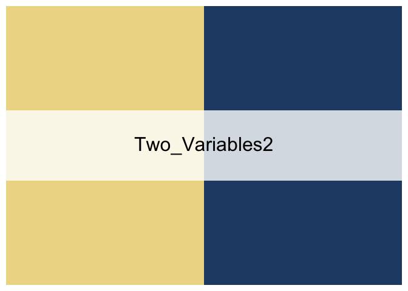

<!-- README.md is generated from README.Rmd. Please edit that file -->
moRandi
=======

moRandi is a R package for **Morandi** color palette, Morandi colors refer to a muted and pale color palette, which is not bright as if covered with a layer of gray tone. Morandi colors has rich connotation without a tendency to show off, releasing the soothing elegance.

**Giorgio Morandi** (1890-1964) was an Italian painter and printmaker who specialized in still life. His paintings are noted for their tonal subtlety in depicting apparently simple subjects, which were limited mainly to vases, bottles, bowls, flowers and landscapes.

Morandi Palette Reference: [morandi\_color\_palette](https://github.com/ThePatrickStar/morandi_color_palette/blob/master/color.md).

Codes are deeply inspired by [wesanderson](https://github.com/karthik/wesanderson).

Any contributions or improvements are very welcome.

Installation
------------

``` r
library(devtools)
devtools::install_github("narcisoyu/moRandi")
```

A brief overview of the Morandi colors
--------------------------------------

``` r
library(moRandi)
morandi_show()
```


    #> [1] "Showing all the morandi colors"

DIY your own morandi palette
----------------------------

Choose the color(s) that you like!

**NOTE**: a numeric vector (in the following example, the `x` is required, and the numbers are the colors you liked from the pie palette)

``` r
x <- c(6, 8, 13, 15, 28, 56)
my_morandi_colors <- morandi_diy(my_colors = x)
my_morandi_colors
```


And some build-in Palette
-------------------------

``` r
library(moRandi)
#For two variables plot
morandi("Two_Variables1")
```


``` r
morandi("Two_Variables2")
```



``` r
#For three variables plot
morandi("Three_Variables1")
```


``` r
morandi("Three_Variables2")
```


``` r
#Other options
morandi("Cava")
```


``` r
morandi("WildDream")
```


``` r
morandi("SweetDream")
```


``` r
morandi("MistyForest")
```


``` r
morandi("Melancholy")
```


``` r
morandi("Unicorn")
```


How to use
----------

### Example: Two variables plot

``` r
library("ggplot2")
ggplot(mtcars, aes(factor(cyl), fill=factor(vs))) +  geom_bar() +
  scale_fill_manual(values = morandi("Two_Variables2"))
```


### Heatmap

``` r
morandi_heatmap_palette <- morandi("Melancholy", 100, type = "continuous")
## make some dummy data
set.seed(123)                                           
data <- matrix(rnorm(100, 0, 10), nrow = 10, ncol = 10)           
colnames(data) <- paste0("col", 1:10)                             
rownames(data) <- paste0("row", 1:10)
## apply morandi palette
heatmap(data, col = morandi_heatmap_palette)
```


